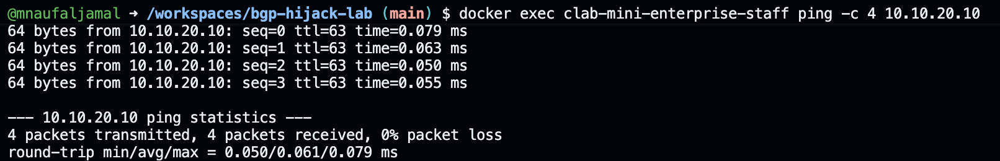
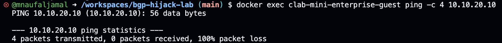
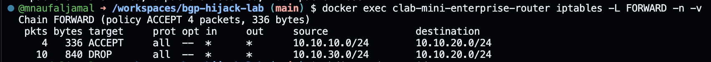

# Mini Enterprise Network – Routing & Firewall

## Overview

Project ini merupakan simulasi jaringan enterprise sederhana menggunakan Containerlab dan Docker.

Jaringan terdiri dari tiga segment:
- Staff LAN
- Server LAN
- Guest LAN

Router digunakan untuk melakukan inter-subnet routing dan menerapkan firewall policy.

## Testing Evidence

### 1. Staff → Server — ALLOWED

Staff (`10.10.10.10`) berhasil berkomunikasi dengan Server (`10.10.20.10`).



### 2. Guest → Server — BLOCKED

Guest (`10.10.30.10`) tidak dapat berkomunikasi dengan Server (`10.10.20.10`) karena diblokir oleh firewall.



### 3. Firewall Rule — DROP

Firewall menunjukkan rule `DROP` untuk trafik dari Guest LAN (`10.10.30.0/24`) menuju Server LAN (`10.10.20.0/24`). Counter paket menunjukkan bahwa trafik Guest benar-benar terkena rule tersebut.



## Network Topology

```text
                 ┌───────────────┐
                 │    ROUTER     │
                 │               │
                 │ eth1          │
                 │ 10.10.10.1/24 │
                 │               │
                 │ eth2          │
                 │ 10.10.20.1/24 │
                 │               │
                 │ eth3          │
                 │ 10.10.30.1/24 │
                 └───────┬───────┘
                         │
          ┌──────────────┼──────────────┐
          │              │              │
          ▼              ▼              ▼
       STAFF           SERVER         GUEST
   10.10.10.10      10.10.20.10    10.10.30.10

       ALLOW             ALLOW          DROP
          └───────────────┬──────────────┘
                          │
                   Server Access

IP Addressing
Device	Interface	IP Address	Role
Router	eth1	10.10.10.1/24	Staff Gateway
Router	eth2	10.10.20.1/24	Server Gateway
Router	eth3	10.10.30.1/24	Guest Gateway
Staff	eth1	10.10.10.10/24	Staff Client
Server	eth1	10.10.20.10/24	Internal Server
Guest	eth1	10.10.30.10/24	Guest Client
Network Policy
Source	Destination	Policy
Staff	Server	ALLOW
Guest	Server	DROP
Testing
Staff → Server
PING 10.10.20.10
0% packet loss

Result: SUCCESS

Guest → Server
PING 10.10.20.10
100% packet loss

Result: BLOCKED BY FIREWALL

Firewall

Firewall menggunakan iptables pada router.

ACCEPT  10.10.10.0/24 → 10.10.20.0/24
DROP    10.10.30.0/24 → 10.10.20.0/24


Technologies : 
Linux
Docker
Containerlab
Alpine Linux
FRRouting
iptables
TCP/IP Networking
Skills Demonstrated
Network segmentation
IP addressing
Default gateway configuration
Inter-subnet routing
IPv4 forwarding
Firewall configuration
Network troubleshooting
Connectivity testing
Container-based networking
